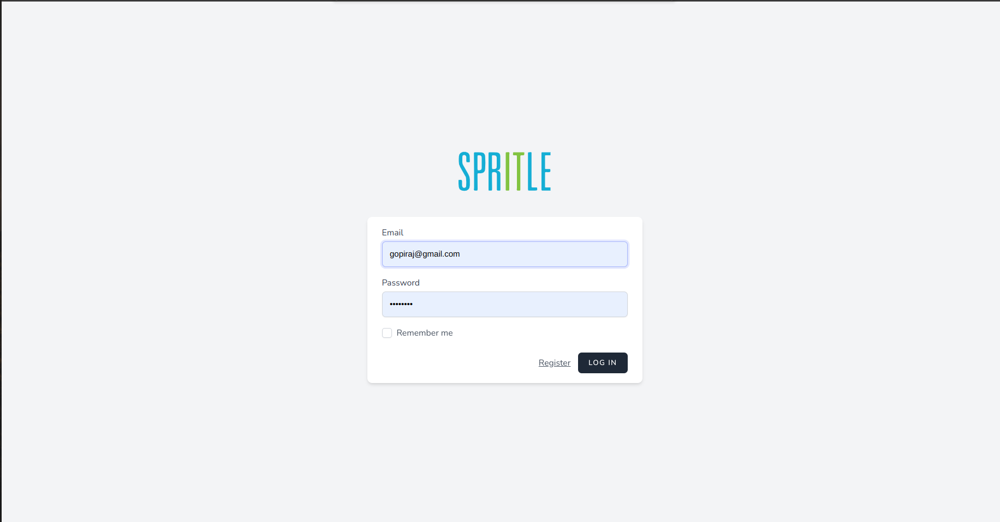
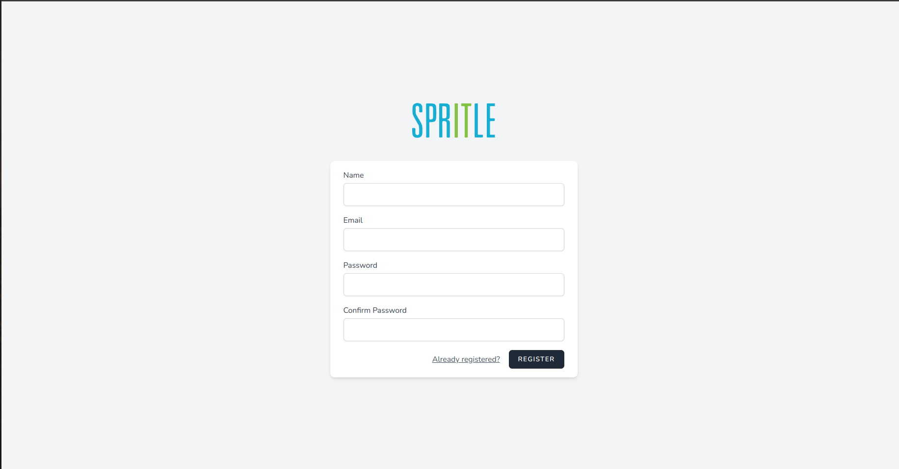
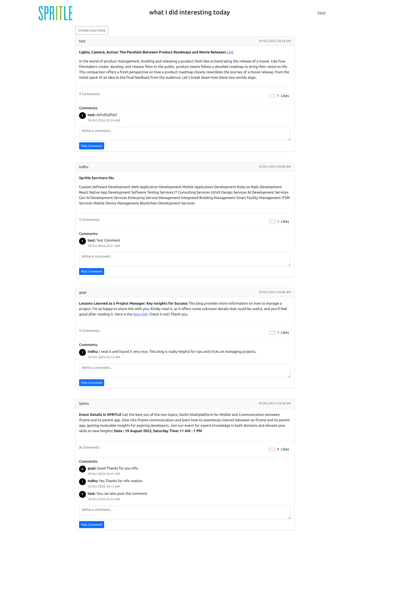
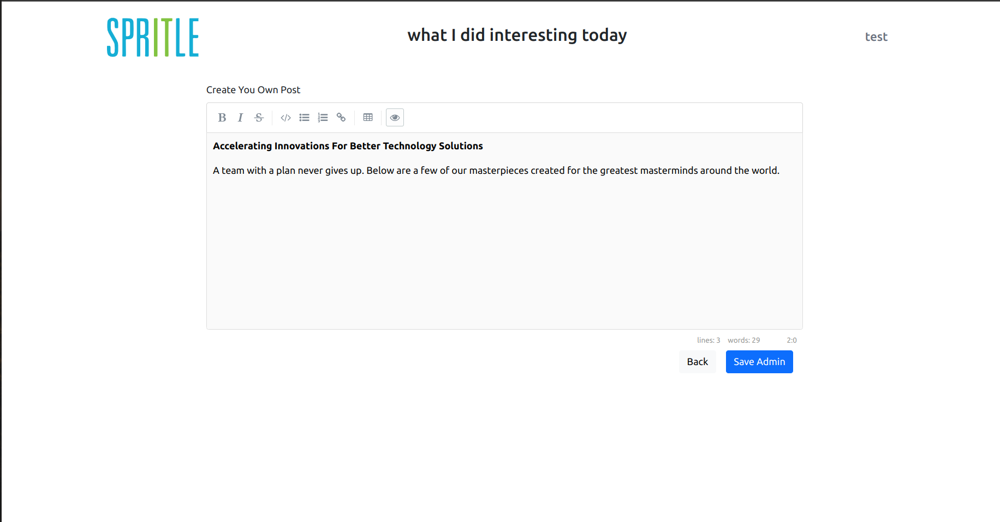
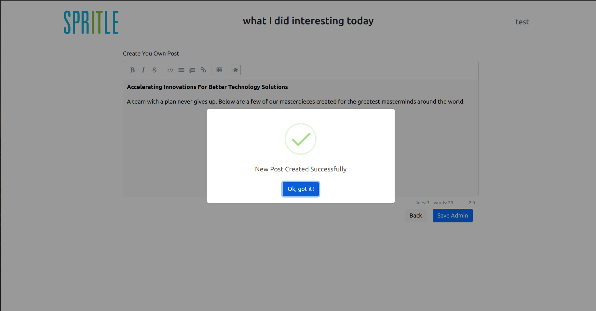

# Project Title

## Task Overview

This project is built using the **Laravel Framework (MVC)** in PHP and the **MySQL** database. The goal of this project was to implement a feature as per the given instructions.

## Technologies Used

- **Framework**: Laravel (MVC)  
- **Database**: MySQL  
- **JavaScript Libraries**:
  - [SimpleMDE: JavaScript Markdown Editor](https://simplemde.com/)
  - [Toastr.js](https://github.com/CodeSeven/toastr)
  - [SweetAlert.js](https://sweetalert.js.org/) for a better user experience

## Demo

Here are some screenshots of the project:

### Screenshot 1


### Screenshot 1



### Screenshot 1


### Screenshot 2


### Screenshot 3


## Instructions

1. Clone the repository:
   ```bash
   https://github.com/GopirajS/spritle_task
